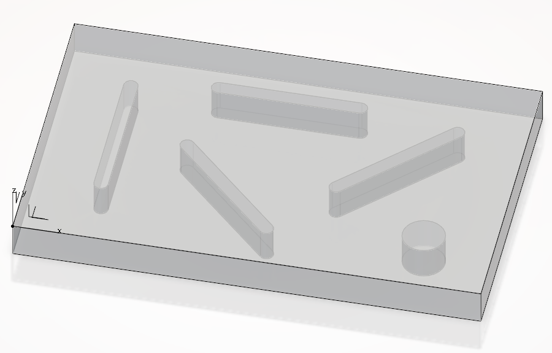
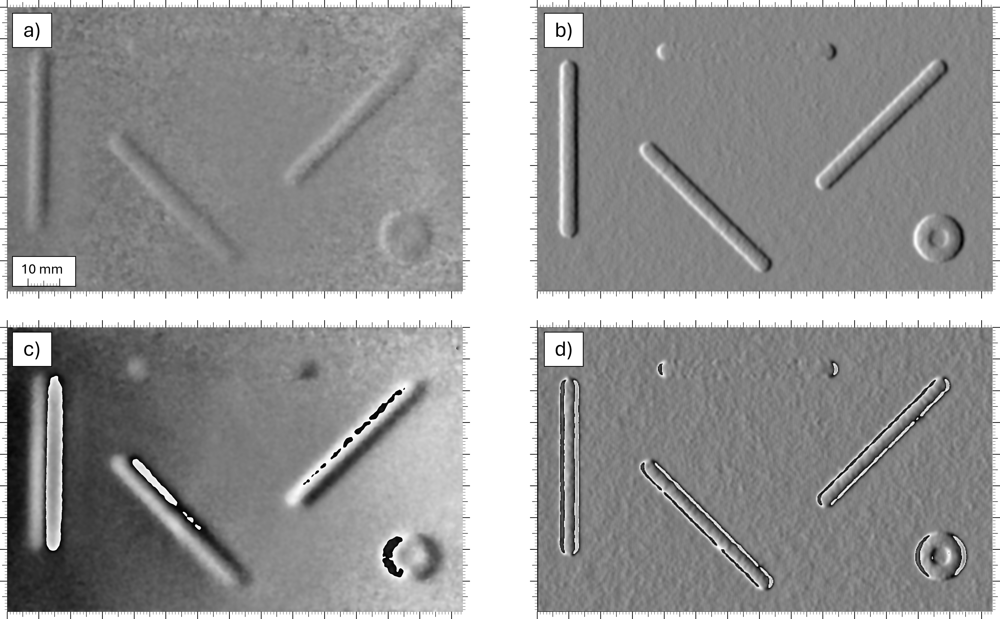

# Sample Results

This folder contains sample images illustrating the geometry and simulation outputs associated with our manuscript submitted to **Optics Express**:

**Plassmann, Jessica; Schuth, Michael; von Freymann, Georg. 
"Simulation of Speckle Interferometric Results for Enhanced Measurement and Automated Defect Detection." 
*Optics Express*, 33(24), 50791–50800 (2025). [DOI: 10.1364/OE.572513](https://doi.org/10.1364/OE.572513), 
Preprint available at [arXiv:2507.00732](https://arxiv.org/abs/2507.00732))**

## Overview

The images here serve as visual examples of the data and results presented in the paper. Detailed explanations of the simulation setup, geometry, and interpretation of these results can be found in the manuscript.

## Contents

**Geometry**  
The geometry of the test specimen is illustrated by the isometric semi-transparent view shown below. This visualization provides an overview of the sample used in the experiments and simulations.

  

**Simulation Outputs**  
The image below shows the full plate simulation results alongside real measurement data, corresponding to the figure presented in the paper:

*Resulting interference patterns from real measurements (a, c) and simulations (b, d) acquired during the cooling phase at a wavelength of 635 nm. The images show the phase difference between two deformation states recorded at t = 2 s and t = 4 s for shearing distances of (a, c) 1 mm and (b, d) 5 mm in the x-direction.*

## Note on Data Acquisition

The images and measurement data presented in this repository were obtained using both custom-built laboratory shearography sensors and commercially available sensors from Tenta Vision GmbH (https://www.tenta-vision.de/). The use of multiple sensor types ensures the robustness and general applicability of the presented methods. Detailed descriptions of the acquisition setups and measurement protocols can be found in the associated publications.
